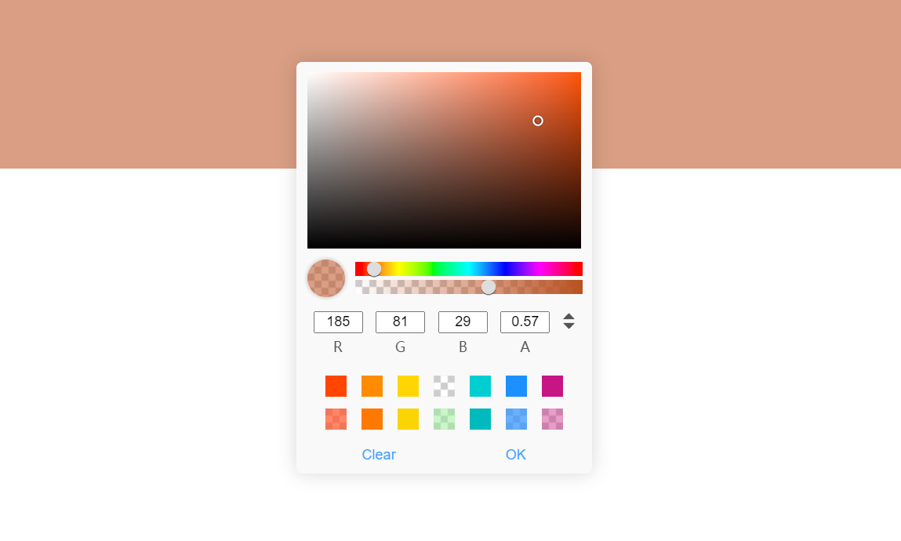

# v3-color-picker

Vue3.0 原生颜色选择器，与浏览器自带几乎一样，支持 Vite2.0，[npm地址](https://www.npmjs.com/package/v3-color-picker)



## [在线文档](https://doc.wssio.com/opensource/v3-color-picker/)

```shell
npm install v3-color-picker
```

或

```shell
yarn add v3-color-picker
```

### CDN

```html
<script src="https://unpkg.com/v3-color-picker/dist/v3-color-picker.umd.min.js">
```

## 使用（Vite 情况下同样使用）

```js
// 全局注册组件、指令、方法
import { createApp } from 'vue';
import V3ColorPicker from 'v3-color-picker';
import App from './App.vue';
const app = createApp(App);
app.use(V3ColorPicker);
app.mount('#app');
// 单个注册某个，以下三种方式均可在单个文件内使用
import { createApp } from 'vue';
import { directive, colorEvent, V3ColorPicker } from 'v3-color-picker';
import App from './App.vue';
const app = createApp(App);
app.component('v3-color-picker', V3ColorPicker); // 只注册组件
app.directive('color', directive); // 只注册指令
app.config.globalProperties.colorEvent = colorEvent; // 只绑定方法
app.mount('#app');
```

```html
<template>
  <div>
    <v3-color-picker v-model:value="color"></v3-color-picker>
    <div class="demo" v-color="colorOptions" :style="{backgroundColor: colorOptions.value}"></div>
    <div class="demo" @click="(event) => colorEvent(event, colorOptions)" :style="{backgroundColor: colorOptions.value}"></div>
  </div>
</template>
<script>
import { defineComponent, ref } from "vue";

export default defineComponent({
  name: "App",
  setup() {
    const color = Vue.ref("rgba(255,0,0,0.5)");
    const colorOptions = ref({
      value: "rgba(255,0,0,0.5)",
      btn: true,
      theme: "light"
    });
    return { color, colorOptions }
  },
});
</script>

<style>
.demo {
  height: 100px;
  width: 100%;
}
</style>
```

```css

```

### 指令方式使用

```html
<template>
  <div class="demo" v-color="colorOptions" :style="{backgroundColor: colorOptions.value}">指令方式使用</div>
</template>
<script>
import { defineComponent, shallowRef } from "vue";

export default defineComponent({
  name: "App",
  directives: {
    color: directive
  },
  setup() {
    const colorOptions = ref({
      value: "rgba(255,0,0,0.5)",
      btn: true,
      theme: "light"
    });
    return { colorOptions }
  },
});
</script>
<style>
.demo {
  height: 100px;
  width: 100%;
}
</style>
```

### 方法方式使用

```html
<template>
  <div class="demo" @click="onClick" :style="{backgroundColor: colorOptions.value}"></div>
</template>
<script>
import { defineComponent, shallowRef } from "vue";
import { colorEvent } from 'v3-color-picker';

export default defineComponent({
  name: "App",
  setup() {
    const colorOptions = ref({
      value: "rgba(255,0,0,0.5)",
      btn: true,
      theme: "light"
    });
    function onClick(event) {
      colorEvent(event, colorOptions.value);
      event.preventDefault();
    }
    return { onClick }
  },
});
</script>
```

### 组件方式使用

```html
<template>
  <v3-color-picker v-model:value="color" btn></v3-color-picker>
  <v3-color-picker v-model:value="color" size="medium" theme="light"></v3-color-picker>
  <v3-color-picker v-model:value="color" size="small"></v3-color-picker>
  <v3-color-picker v-model:value="color" :width="300"></v3-color-picker>
</template>
<script>
import { defineComponent, nextTick, ref, shallowRef } from "vue";
import { V3ColorPicker } from 'v3-color-picker';

export default defineComponent({
  name: "App",
  components: {
    V3ColorPicker
  },
  setup() {
    const color = ref("rgba(255,0,0,0.5)");
    return { color }
  },
});
</script>
```

## 参数说明

### 方法使用参数

colorEvent(event, options)，`event`：事件对象，`options`：公共参数与方法参数

### 公共参数

|  属性  |        描述        |            类型            | 是否必填 | 默认值  |
| :----: | :----------------: | :------------------------: | :------: | :-----: |
| value  |     初始颜色值     | `string` \| `rbg` \| `hsl` | `false`  | `#fff`  |
| theme  |        主题        |     `dark` \| `light`      | `false`  | `dark`  |
| height | 颜色选择器区域高度 |          `number`          | `false`  |  `150`  |
| width  | 颜色选择器区域宽度 |          `number`          | `false`  |  `233`  |
| colors |    预选颜色列表    |         `[string]`         | `false`  |  `[]`   |
|  btn   |  是否显示按钮按钮  |         `boolean`          | `false`  | `false` |
| zIndex |      菜单层级      |          `number`          | `false`  |   `2`   |

### 组件参数

| 属性  |   描述   |                     类型                     | 是否必填 |   默认值    |
| :---: | :------: | :------------------------------------------: | :------: | :---------: |
| size  | 组件大小 | `undefined` \| `medium` \| `small` \| `mini` | `false`  | `undefined` |

### 指令、方法参数

|  属性  |           描述           |    类型    | 是否必填 | 默认值 |
| :----: | :----------------------: | :--------: | :------: | :----: |
| change | 颜色值发生改变时触发事件 | `Function` | `false`  | `none` |
